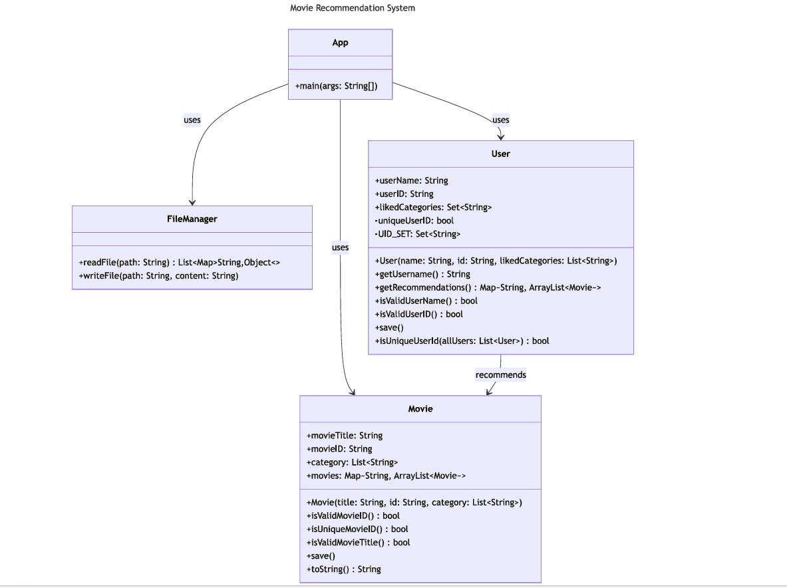

# Movie Recommendation System

A simple Java program that reads movies and users from text files, validates the input, and generates movie recommendations based on user preferences.

## Features

* Reads data from `movies.txt` and `users.txt`
* Validates movie IDs, titles, and user information
* Stops execution when the first error is detected
* Recommends movies based on user preferred categories
* Outputs recommendations to a file or console

## Class Diagram



## Input Files

### movies.txt

Format:

```
Movie Title,MovieID
category1,category2
```

Example:

```
Mad Max,MM123
action
The Conjuring,TC129
horror
```

### users.txt

Format:

```
Username,UserID
category1,category2,..
```

Example:

```
Moamen,12345678M
horror
Ali,987654321
drama,horror
```

## Run the Program

Run the program with the following arguments:

```
<movies_file.txt> <users_file.txt> <output_file.txt>
```

Example:

```
movies.txt users.txt output.txt
```

If the output file is provided, results will be written to the file. Otherwise, they will be printed to the console.

## Example Output

```
For User: Moamen,12345678M
horror: TC129-The Conjuring,TN130-The Nun,S132-Sinister
```
